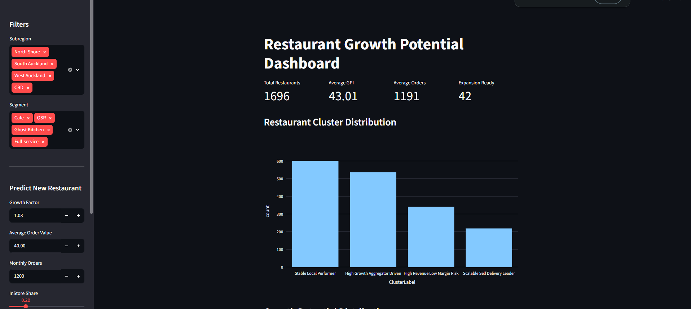
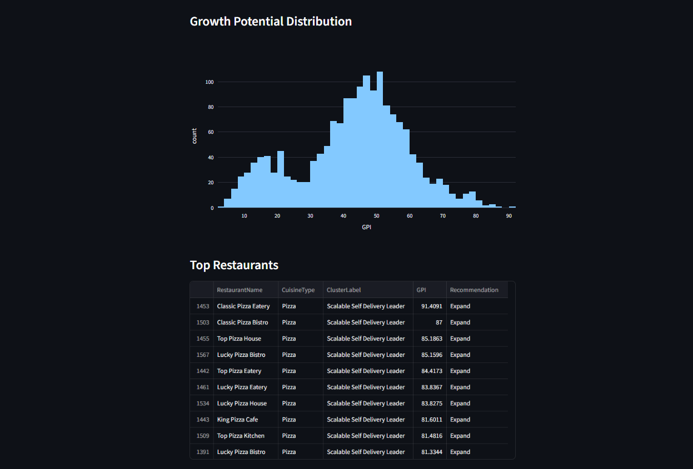
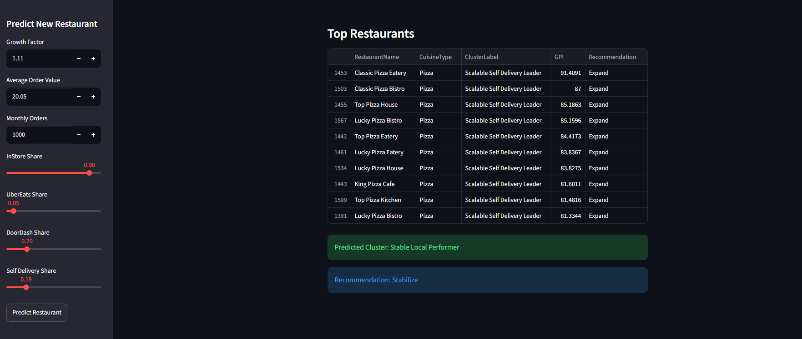

#  Restaurant Growth Potential Modeling & Strategic Classification System

##  Project Overview

This project builds a data-driven restaurant intelligence system that identifies restaurants with strong potential for sustainable growth.

## Streamlit App link
https://restaurantgrowthclassifier.streamlit.app/

Instead of only analyzing current profit, this system evaluates multiple business dimensions such as:

- Growth momentum
- Revenue quality
- Cost efficiency
- Channel dependency
- Delivery scalability
- Operational performance

The project uses machine learning and clustering techniques to classify restaurants into strategic business categories and generate recommendations.

---

##  Problem Statement

Restaurant businesses often use a one-size-fits-all strategy for expansion decisions.

However, restaurants can have very different operational structures:

- High growth but low margins
- Stable but under-scaled
- Highly profitable but geographically constrained
- Overextended and difficult to sustain

This project aims to answer:

**Which restaurants are structurally positioned for sustainable growth, and how should they be classified?**

---

##  Dataset Information

Dataset contains **1696 restaurant records** and **30 features**.

Features include:

### Growth & Demand
- MonthlyOrders
- GrowthFactor
- Average Order Value (AOV)

### Channel Mix
- InStoreShare
- UberEats Share
- DoorDash Share
- Self Delivery Share

### Cost & Efficiency
- COGS Rate
- OPEX Rate
- Commission Rate
- Delivery Costs

### Logistics
- Delivery Radius
- Delivery Cost per Order

### Financial Metrics
- Revenue
- Net Profit
- Channel profitability

---

## ⚙️ Technologies Used

- Python
- Pandas
- NumPy
- Scikit-Learn
- Matplotlib
- Seaborn
- Plotly
- Streamlit

---

##  Machine Learning Workflow

### 1. Data Preprocessing

- Missing value checking
- Feature scaling
- Data normalization
- Categorical handling

---

### 2. Exploratory Data Analysis

Performed:

- Distribution analysis
- Correlation heatmaps
- Revenue analysis
- Segment analysis
- Cuisine analysis

---

### 3. Dimensionality Reduction

Applied:

- PCA (Principal Component Analysis)

Purpose:

- Reduce feature complexity
- Discover latent patterns

---

### 4. Restaurant Clustering

Applied:

- K-Means clustering
- Elbow Method
- Silhouette Score

Generated restaurant groups:

| Cluster | Description |
|----------|-------------|
| Cluster 1 | Stable Local Performer |
| Cluster 2 | High Growth Aggregator Driven |
| Cluster 3 | High Revenue Low Margin Risk |
| Cluster 4 | Scalable Self Delivery Leader |

---

### 5. Growth Potential Index (GPI)

Growth Potential Index was calculated using:

GPI =

- Growth signals
- Delivery scalability
- Profitability
- Channel balance
- Revenue quality

---

##  Strategic Recommendations

Restaurants receive recommendations such as:

- Expand
- Optimize
- Stabilize

---

#  Streamlit Dashboard Features

Dashboard includes:

 Interactive filters

- Subregion
- Segment

 KPI cards

- Total Restaurants
- Average GPI
- Average Orders
- Expansion Ready Count

 Visualizations

- Cluster distribution
- Growth potential distribution
- Top restaurants table

 New restaurant prediction module

Users can input:

- Growth factor
- Average Order Value
- Monthly orders
- Delivery shares

The system predicts:

- Restaurant category
- Business recommendation

---

#  Dashboard Screenshots

## Main Dashboard



## Main Dashboard



---

## Prediction Module



## Prediction Module


---

# Run Project Locally

Clone repository:

```bash
git clone YOUR_REPOSITORY_LINK
```

Move to project folder:

```bash
cd restaurant-project
```

Install dependencies:

```bash
pip install -r requirements.txt
```

Run Streamlit:

```bash
streamlit run app.py
```

---

#  Live Demo

Streamlit App:

linkkkkkkk


---

#  Project Structure

```text
restaurant-project
│
├── app.py
├── Restaurant_Growth_Final.csv
├── requirements.txt
├── README.md
│
├── dashboard
│      └── dashboard.png
│
├── prediction
│      └── prediction.png
```

---

#  Results

Key findings:

- Stable Local Performers represented the largest segment.
- Self-delivery focused restaurants achieved higher scalability.
- Heavy aggregator dependence reduced profitability.
- Restaurants with balanced channels achieved stronger long-term growth potential.

---

# Author

Vishesh Sharma

Data Science Intern Project
